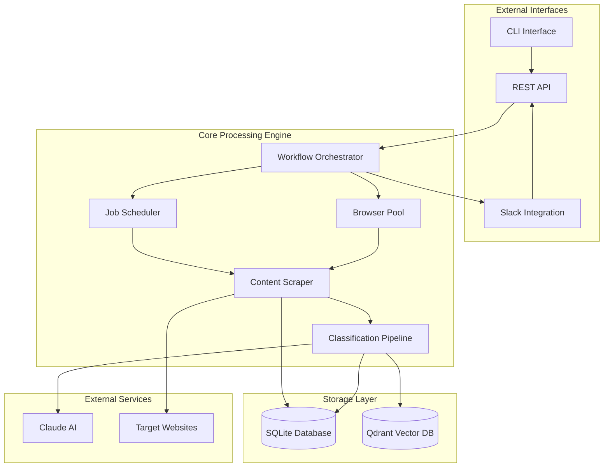
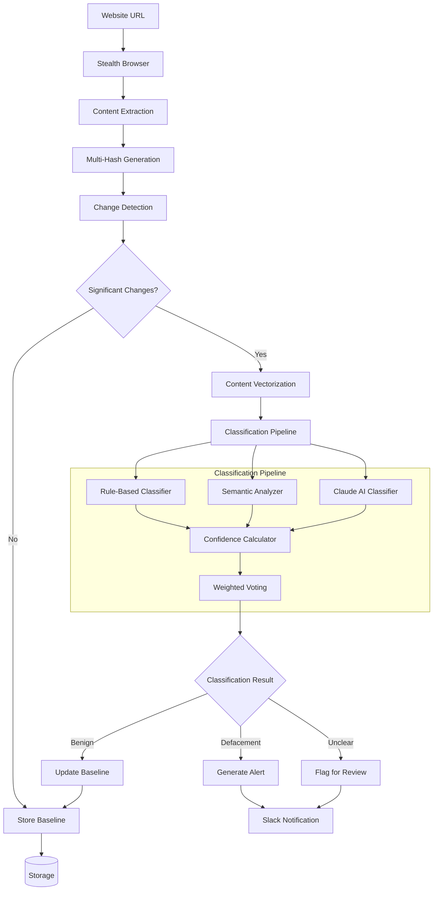
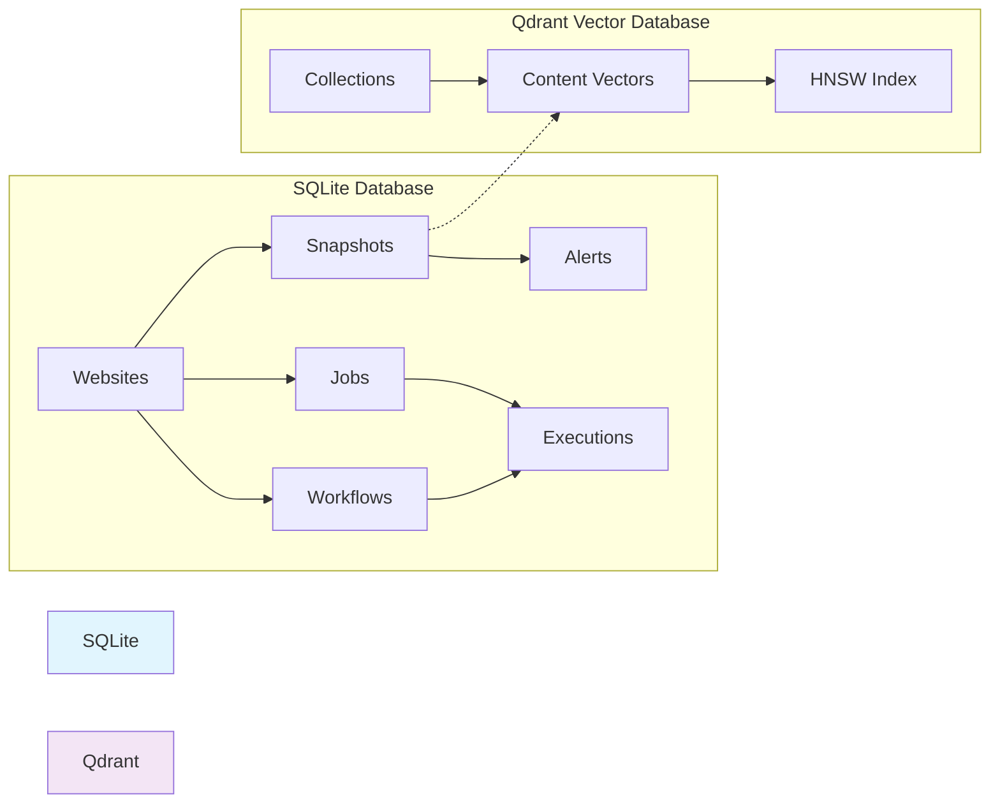
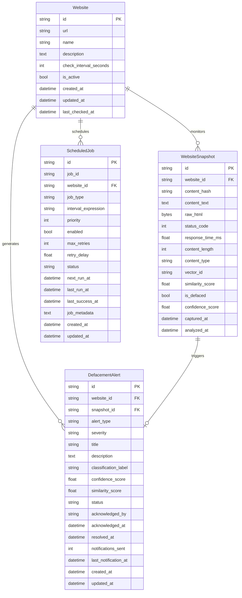
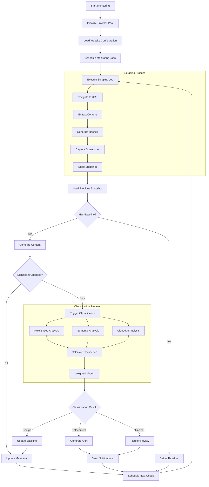
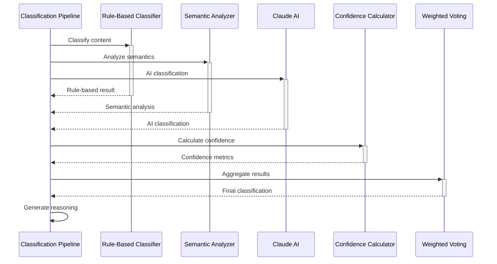

# Site Change Analysis Architecture

## Executive Summary

The webdeface monitoring system employs a sophisticated multi-layered architecture for detecting and analyzing website defacements and unauthorized modifications. The system combines stealth browser automation, multi-dimensional content analysis, advanced similarity algorithms, and AI-powered classification to provide comprehensive website monitoring capabilities.

### Key Capabilities
- **Real-time website monitoring** with stealth browser technology
- **Multi-dimensional change detection** using content, structural, and visual analysis
- **Three-stage classification pipeline** combining rule-based, semantic, and AI analysis
- **Vector-based semantic understanding** using transformer embeddings
- **Intelligent workflow orchestration** with dependency management
- **Dual storage architecture** (SQLite + Qdrant) for metadata and vector search
- **REST API with Slack integration** for notifications and control

---

## System Architecture

### High-Level Component Overview



### Data Flow Architecture



### Storage Architecture



---

## Core Algorithms

### Content Extraction Algorithm

The content extraction process in [`extractor.py`](src/webdeface/scraper/extractor.py:16) implements sophisticated DOM analysis and content preprocessing:

#### DOM Traversal Implementation
```python
def traverse_element(element, depth=0):
    if isinstance(element, Tag):
        # Skip ignored tags
        if element.name in self.ignore_tags:
            return
        
        element_info = {
            "tag": element.name,
            "depth": depth,
            "classes": element.get("class", []),
            "id": element.get("id"),
            "text_length": len(self._get_clean_text(element)),
            "child_count": len(list(element.children)),
        }
        
        # Recursively process children (limit depth to avoid excessive nesting)
        if depth < 10:
            for child in element.children:
                traverse_element(child, depth + 1)
```

#### Content Normalization Pipeline
1. **HTML tag removal** with BeautifulSoup parsing
2. **Dynamic content filtering** using regex patterns:
   - Date/time stamps: `r"\d{4}-\d{2}-\d{2}"`
   - Session IDs: `r'session[_-]?id["\']?\s*[:=]\s*["\']?[\w\-]+'`
   - CSRF tokens: `r'csrf[_-]?token["\']?\s*[:=]\s*["\']?[\w\-]+'`
3. **Whitespace normalization**: `re.sub(r"\s+", " ", text)`
4. **Keyword extraction** with stopword filtering

### Multi-Hash Fingerprinting System

The system generates multiple content fingerprints using [`ContentHasher`](src/webdeface/scraper/hashing.py:40):

#### Hash Types Generated
1. **Content Hash** (Blake3): Main content with dynamic element removal
2. **Structure Hash** (Blake2b): DOM outline with element signatures
3. **Semantic Hash** (Blake2b): Semantically meaningful content only
4. **Block Hash** (Blake2b): Sorted text blocks for reordering detection

#### Structure Hash Algorithm
```python
def hash_structure(self, dom_outline: list[dict[str, Any]]) -> ContentHash:
    structure_elements = []
    for element in dom_outline:
        # Create a signature for each element
        signature = f"{element.get('tag', '')}:{element.get('depth', 0)}"
        
        # Add classes if present
        classes = element.get("classes", [])
        if classes:
            signature += f".{'.'.join(sorted(classes))}"
        
        # Add ID if present
        element_id = element.get("id")
        if element_id:
            signature += f"#{element_id}"
        
        structure_elements.append(signature)
    
    structure_string = "|".join(structure_elements)
    return hashlib.blake2b(structure_string.encode("utf-8"), digest_size=32).hexdigest()
```

### Similarity Calculation Algorithms

The [`ContentProcessor`](src/webdeface/scraper/extractor.py:351) implements sophisticated similarity calculations:

#### Multi-Coefficient Similarity Calculation
```python
def calculate_text_similarity(self, text1: str, text2: str) -> float:
    # Extract keywords from both texts
    keywords1 = set(self.extract_keywords(text1))
    keywords2 = set(self.extract_keywords(text2))
    
    # Calculate intersection and sizes
    intersection = len(keywords1.intersection(keywords2))
    min_size = min(len(keywords1), len(keywords2))
    max_size = max(len(keywords1), len(keywords2))
    union = len(keywords1.union(keywords2))
    
    # Multiple similarity measures for robust comparison
    jaccard_similarity = intersection / union if union > 0 else 0.0
    overlap_coefficient = intersection / min_size if min_size > 0 else 0.0
    dice_coefficient = (2 * intersection) / (len(keywords1) + len(keywords2)) if (len(keywords1) + len(keywords2)) > 0 else 0.0
    
    # Weighted combination with emphasis on overlap coefficient
    base_similarity = (jaccard_similarity * 0.2) + (overlap_coefficient * 0.6) + (dice_coefficient * 0.2)
    
    # Apply bonus for substantial overlap (50% or more of smaller set)
    overlap_ratio = intersection / min_size if min_size > 0 else 0.0
    if overlap_ratio >= 0.5:
        bonus = min(0.15, overlap_ratio * 0.2)
        base_similarity += bonus
    
    return min(1.0, base_similarity)
```

#### Mathematical Formulas

**Jaccard Similarity**: `J(A,B) = |A ∩ B| / |A ∪ B|`

**Overlap Coefficient**: `O(A,B) = |A ∩ B| / min(|A|, |B|)`

**Dice Coefficient**: `D(A,B) = 2|A ∩ B| / (|A| + |B|)`

**Combined Similarity**: `S = 0.2×J + 0.6×O + 0.2×D + bonus`

### Vector Embedding and Similarity Search

The [`ContentVectorizer`](src/webdeface/classifier/vectorizer.py:45) implements semantic analysis:

#### Content Preprocessing Pipeline
```python
def _preprocess_text(self, text: str) -> str:
    if not text:
        return ""
    
    # Apply cleanup patterns
    cleaned = text
    for pattern, replacement in self.cleanup_patterns:
        cleaned = re.sub(pattern, replacement, cleaned)
    
    # Normalize case and strip
    cleaned = cleaned.lower().strip()
    
    # Truncate if too long
    if len(cleaned) > self.max_content_length:
        cleaned = cleaned[:self.max_content_length]
    
    return cleaned
```

#### Vector Generation Process
1. **Text preprocessing** with HTML tag removal and normalization
2. **Content chunking** for long text (threshold: 1000 characters)
3. **SentenceTransformer encoding** using `all-MiniLM-L6-v2` model
4. **Embedding averaging** for multi-chunk content
5. **Vector storage** in Qdrant with metadata

#### Cosine Similarity Calculation
```python
async def calculate_similarity(self, vector1: np.ndarray, vector2: np.ndarray, method: str = "cosine") -> float:
    if method == "cosine":
        dot_product = np.dot(vector1, vector2)
        norm1 = np.linalg.norm(vector1)
        norm2 = np.linalg.norm(vector2)
        
        if norm1 == 0 or norm2 == 0:
            return 0.0
        
        similarity = dot_product / (norm1 * norm2)
        return float(similarity)
```

### Multi-Stage Classification Pipeline

The [`ClassificationPipeline`](src/webdeface/classifier/pipeline.py:422) coordinates three distinct classifiers:

#### 1. Rule-Based Classification
```python
class RuleBasedClassifier:
    def __init__(self):
        self.defacement_keywords = {
            "hacked": 0.9,
            "owned": 0.8,
            "pwned": 0.8,
            "defaced": 0.95,
            "unauthorized": 0.7,
            "breached": 0.7,
            "compromised": 0.7,
            # ... more patterns
        }
        
        self.suspicious_patterns = {
            r"(?i)hacked\s+by\s+\w+": 0.95,
            r"(?i)owned\s+by\s+\w+": 0.9,
            r"(?i)defaced\s+by\s+\w+": 0.95,
            # ... more regex patterns
        }
```

#### 2. Semantic Analysis
- Vector embedding comparison using cosine similarity
- Content drift detection with configurable thresholds
- Suspicious pattern detection in semantic space

#### 3. Claude AI Integration
- LLM-powered analysis for complex cases
- Context-aware classification with website profiles
- Natural language explanation generation

### Confidence Calculation Methodology

The [`ConfidenceCalculator`](src/webdeface/classifier/pipeline.py:178) implements sophisticated confidence scoring:

#### Confidence Factors
```python
self.confidence_factors = {
    "agreement": 0.3,      # Agreement between classifiers
    "clarity": 0.2,        # Clarity of individual results
    "context": 0.2,        # Contextual information quality
    "historical": 0.15,    # Historical pattern consistency
    "semantic": 0.15       # Semantic analysis quality
}
```

#### Weighted Voting Algorithm
```python
def _weighted_vote(self, claude_result, semantic_analysis, rule_based_result, weights):
    votes = {
        Classification.BENIGN: 0.0,
        Classification.DEFACEMENT: 0.0,
        Classification.UNCLEAR: 0.0,
    }
    
    # Claude vote with confidence weighting
    if claude_result and weights.get("claude", 0) > 0:
        vote_weight = weights["claude"] * claude_result.confidence
        votes[claude_result.label] += vote_weight
    
    # Rule-based vote
    if rule_based_result and weights.get("rule_based", 0) > 0:
        vote_weight = weights["rule_based"] * rule_based_result.confidence
        votes[rule_based_result.classification] += vote_weight
    
    # Semantic vote based on risk level
    if semantic_analysis and weights.get("semantic", 0) > 0:
        summary = semantic_analysis.get("change_summary", {})
        risk_level = summary.get("risk_level", "medium")
        
        vote_weight = weights["semantic"]
        if risk_level in ["high", "critical"]:
            votes[Classification.DEFACEMENT] += vote_weight * 0.8
        elif risk_level == "low":
            votes[Classification.BENIGN] += vote_weight * 0.8
        else:
            votes[Classification.UNCLEAR] += vote_weight * 0.6
    
    # Return classification with highest vote
    return max(votes, key=votes.get)
```

---

## Component Deep Dive

### Scraper Module

#### Browser Pool Management
The [`BrowserPool`](src/webdeface/scraper/browser.py:177) provides concurrent browser instances:

```python
class BrowserPool:
    def __init__(self, max_browsers: int = 3):
        self.max_browsers = max_browsers
        self.browsers: list[StealthBrowser] = []
        self.available_browsers: asyncio.Queue = asyncio.Queue()
```

**Features:**
- Anti-detection stealth configuration
- User agent rotation and header spoofing
- JavaScript injection for webdriver property masking
- Connection pooling for performance optimization

#### Content Extraction Pipeline
The [`ContentExtractor`](src/webdeface/scraper/extractor.py:16) implements comprehensive content analysis:

**Extraction Components:**
1. **Text blocks** from significant HTML tags (`h1`, `h2`, `p`, `div`, etc.)
2. **DOM outline** with element depth and structure
3. **Links** with external/internal classification
4. **Images** with metadata extraction
5. **Forms** with input field analysis
6. **Main content** using content-area selectors

#### Hash Generation System
The [`ContentHasher`](src/webdeface/scraper/hashing.py:40) creates multiple content fingerprints:

**Hash Types:**
- **Content Hash**: Blake3 hash of normalized main content
- **Structure Hash**: Blake2b hash of DOM element signatures  
- **Text Block Hash**: Blake2b hash of sorted text blocks
- **Semantic Hash**: Blake2b hash of semantic content only

### Classifier Module

#### Pipeline Orchestration
The [`ClassificationPipeline`](src/webdeface/classifier/pipeline.py:422) coordinates multiple classifiers:

**Execution Modes:**
- **Parallel execution**: All classifiers run concurrently
- **Sequential execution**: Fallback mode with error isolation
- **Adaptive weighting**: Dynamic weight adjustment based on performance

#### Vectorization Engine
The [`ContentVectorizer`](src/webdeface/classifier/vectorizer.py:45) handles semantic analysis:

**Model Configuration:**
- **Model**: `all-MiniLM-L6-v2` SentenceTransformer
- **Vector size**: 384 dimensions
- **Max content length**: 8000 characters
- **Chunk threshold**: 1000 characters for splitting

**Vector Types Generated:**
- Main content vectors
- Title vectors  
- Text block vectors
- Meta description vectors
- Combined semantic vectors

### Scheduler Module

#### Job Management
The [`SchedulerManager`](src/webdeface/scheduler/manager.py:37) provides sophisticated scheduling:

**Features:**
- APScheduler integration with SQLAlchemy persistence
- Cron and interval-based scheduling
- Priority-based job queuing
- Retry logic with exponential backoff
- Circuit breaker patterns for reliability

**Job Configuration:**
```python
job_defaults = {
    "coalesce": False,
    "max_instances": 3,
    "misfire_grace_time": 30,
}
```

#### Workflow Orchestration
- Topological sorting for dependency management
- Step-by-step execution with error handling
- Parallel execution where dependencies allow
- Rollback capabilities for failed workflows

### Storage Systems

#### SQLite Schema Design

The [`SQLite models`](src/webdeface/storage/sqlite/models.py:27) provide comprehensive data persistence:



**Key Indexes:**
- `ix_websites_url`: Fast URL lookups
- `ix_snapshots_content_hash`: Content deduplication
- `ix_snapshots_website_captured`: Time-series queries
- `ix_alerts_website_status`: Active alert monitoring

#### Qdrant Vector Database

The [`QdrantManager`](src/webdeface/storage/qdrant/client.py:16) handles vector operations:

**Collection Configuration:**
```python
vectors_config=models.VectorParams(
    size=384,  # all-MiniLM-L6-v2 dimensions
    distance=models.Distance.COSINE
),
hnsw_config=models.HnswConfig(
    m=16,               # Number of bi-directional links
    ef_construct=100,   # Construction time trade-off
    full_scan_threshold=10000,
    max_indexing_threads=0,
    on_disk=False,
)
```

**HNSW Algorithm Parameters:**
- **M**: 16 bi-directional links per node
- **ef_construct**: 100 for build-time quality vs speed
- **Distance metric**: Cosine similarity for semantic search

### API and Notification Infrastructure

#### REST API Design
The API follows RESTful principles with comprehensive endpoints:

**Monitoring Control** ([`monitoring.py`](src/webdeface/api/routers/monitoring.py:56)):
- `POST /start`: Start monitoring for websites
- `POST /stop`: Stop monitoring operations  
- `POST /pause`: Pause all monitoring jobs
- `POST /resume`: Resume paused jobs
- `GET /status`: Get system status

**Authentication & Authorization:**
- Permission-based access control
- API key and JWT token support
- Role-based operation restrictions

#### Slack Integration
- Real-time alert notifications
- Interactive command interface
- Status reporting and system control
- Rich message formatting with attachments

---

## Data Models and Schemas

### SQLite Database Schema

#### Core Tables

**Websites Table:**
```sql
CREATE TABLE websites (
    id VARCHAR(36) PRIMARY KEY,
    url VARCHAR(2048) NOT NULL UNIQUE,
    name VARCHAR(255) NOT NULL,
    description TEXT,
    check_interval_seconds INTEGER DEFAULT 300,
    is_active BOOLEAN DEFAULT TRUE,
    created_at DATETIME DEFAULT CURRENT_TIMESTAMP,
    updated_at DATETIME DEFAULT CURRENT_TIMESTAMP,
    last_checked_at DATETIME
);
```

**Website Snapshots Table:**
```sql  
CREATE TABLE website_snapshots (
    id VARCHAR(36) PRIMARY KEY,
    website_id VARCHAR(36) REFERENCES websites(id),
    content_hash VARCHAR(64) NOT NULL,
    content_text TEXT,
    raw_html BLOB,
    status_code INTEGER,
    response_time_ms REAL,
    content_length INTEGER,
    content_type VARCHAR(255),
    vector_id VARCHAR(255),
    similarity_score REAL,
    is_defaced BOOLEAN,
    confidence_score REAL,
    captured_at DATETIME DEFAULT CURRENT_TIMESTAMP,
    analyzed_at DATETIME
);
```

**Defacement Alerts Table:**
```sql
CREATE TABLE defacement_alerts (
    id VARCHAR(36) PRIMARY KEY,
    website_id VARCHAR(36) REFERENCES websites(id),
    snapshot_id VARCHAR(36) REFERENCES website_snapshots(id),
    alert_type VARCHAR(50) NOT NULL,
    severity VARCHAR(20) DEFAULT 'medium',
    title VARCHAR(255) NOT NULL,
    description TEXT NOT NULL,
    classification_label VARCHAR(100),
    confidence_score REAL,
    similarity_score REAL,
    status VARCHAR(20) DEFAULT 'open',
    acknowledged_by VARCHAR(255),
    acknowledged_at DATETIME,
    resolved_at DATETIME,
    notifications_sent INTEGER DEFAULT 0,
    last_notification_at DATETIME,
    created_at DATETIME DEFAULT CURRENT_TIMESTAMP,
    updated_at DATETIME DEFAULT CURRENT_TIMESTAMP
);
```

### Qdrant Vector Collection Structure

#### Vector Payload Schema
```json
{
    "website_id": "uuid-string",
    "snapshot_id": "uuid-string", 
    "content_hash": "hash-string",
    "content_type": "main_content|title|text_blocks|combined",
    "model_name": "all-MiniLM-L6-v2",
    "vector_size": 384,
    "created_at": "iso-timestamp",
    "metadata": {
        "original_length": 1500,
        "processed_length": 1200,
        "chunk_count": 1,
        "source": "content_extraction"
    }
}
```

### API Data Models

#### Classification Request
```python
@dataclass
class ClassificationRequest:
    site_url: str
    changed_content: list[str]
    static_context: list[str]
    site_context: Optional[dict[str, Any]] = None
    previous_classification: Optional[str] = None
```

#### Classification Result  
```python
@dataclass
class ClassificationPipelineResult:
    final_classification: Classification
    confidence_score: float
    confidence_level: ConfidenceLevel
    reasoning: str
    claude_result: Optional[ClassificationResult] = None
    semantic_analysis: Optional[dict[str, Any]] = None
    rule_based_result: Optional[dict[str, Any]] = None
    classifier_weights: dict[str, float] = None
    consensus_metrics: dict[str, Any] = None
    processing_time: float = 0.0
    timestamp: datetime = None
```

#### Scraping Job Configuration
```python
@dataclass  
class ScrapingJob:
    website_id: str
    url: str
    job_id: str
    priority: int = 1
    retry_count: int = 0
    max_retries: int = 3
    created_at: datetime = None
    scheduled_at: datetime = None
    started_at: Optional[datetime] = None
    completed_at: Optional[datetime] = None
    error_message: Optional[str] = None
    metadata: dict[str, Any] = None
```

---

## Workflow Documentation

### Website Monitoring Workflow



### Change Detection Process

The change detection process implements multi-layered analysis:

#### 1. Hash Comparison
```python
def _compare_content_hashes(self, old_content, new_content, change_details):
    old_hash = old_content.get("content_hash")
    new_hash = new_content.get("content_hash")
    
    if old_hash == new_hash:
        similarity = 1.0
    else:
        # Calculate text similarity for detailed analysis
        old_text = old_content.get("main_content", "")
        new_text = new_content.get("main_content", "")
        similarity = self._calculate_text_similarity(old_text, new_text)
    
    change_details["content_similarity"] = similarity
    change_details["content_hash_changed"] = old_hash != new_hash
    
    return similarity
```

#### 2. Structural Analysis
- DOM element comparison with depth consideration
- CSS class and ID stability analysis
- Element count and hierarchy changes

#### 3. Visual Comparison
- Screenshot differential analysis
- Pixel-level change detection
- Layout modification identification

#### 4. Semantic Drift Detection
- Vector embedding comparison
- Content topic analysis
- Language pattern changes

### Classification Pipeline Execution



### Error Handling and Retry Mechanisms

#### Circuit Breaker Pattern
```python
class CircuitBreaker:
    def __init__(self, failure_threshold=5, recovery_timeout=60):
        self.failure_threshold = failure_threshold
        self.recovery_timeout = recovery_timeout
        self.failure_count = 0
        self.last_failure_time = None
        self.state = "CLOSED"  # CLOSED, OPEN, HALF_OPEN
```

#### Retry Configuration
```python
@dataclass
class RetryConfig:
    max_retries: int = 3
    initial_delay: float = 1.0
    max_delay: float = 60.0
    exponential_base: float = 2.0
    jitter: bool = True
```

#### Exponential Backoff Implementation
```python
async def _handle_job_retry(self, execution, exception):
    delay = min(
        retry_config.initial_delay * (retry_config.exponential_base ** (execution.attempt_number - 1)),
        retry_config.max_delay,
    )
    
    # Add jitter if enabled
    if retry_config.jitter:
        delay *= 0.5 + random.random() * 0.5
    
    # Schedule retry with calculated delay
    await asyncio.sleep(delay)
```

---

## Performance and Reliability

### Concurrent Processing Strategies

#### Browser Pool Management
```python
class BrowserPool:
    def __init__(self, max_browsers: int = 3):
        self.max_browsers = max_browsers
        self.browsers: list[StealthBrowser] = []
        self.available_browsers: asyncio.Queue = asyncio.Queue()
```

**Benefits:**
- Reduced browser initialization overhead
- Connection reuse for better performance
- Concurrent website processing
- Resource usage optimization

#### Worker Pool Architecture
```python
class ScrapingOrchestrator:
    def __init__(self, max_workers: int = 3, max_queue_size: int = 1000):
        self.max_workers = max_workers
        self.queue = ScrapingQueue(max_queue_size)
        self.workers: list[ScrapingWorker] = []
```

**Features:**
- Parallel job processing
- Priority-based queue management
- Load balancing across workers
- Graceful degradation under load

### Resource Optimization Techniques

#### Memory Management
- Content chunking for large websites
- Vector embedding batching
- Database connection pooling
- Garbage collection optimization

#### CPU Optimization
- Async/await patterns throughout
- Non-blocking I/O operations
- Efficient data structures
- Lazy loading strategies

#### Network Optimization
- Request batching where possible
- Connection keep-alive
- Compression for data transfer
- Rate limiting to avoid blocking

### Error Handling Patterns

#### Hierarchical Error Recovery
```python
try:
    # Primary operation
    result = await primary_operation()
except SpecificError as e:
    # Specific error handling
    result = await fallback_operation()
except Exception as e:
    # Generic error handling
    logger.error(f"Operation failed: {str(e)}")
    raise
```

#### Circuit Breaker Implementation
- Failure threshold monitoring
- Automatic service isolation
- Progressive recovery testing
- Health check integration

### Health Monitoring

#### Component Health Checks
```python
async def health_check(self) -> list[HealthCheckResult]:
    results = []
    
    # Check scheduler status
    results.append(HealthCheckResult(
        component="scheduler",
        healthy=self.is_running and self.scheduler is not None,
        message="APScheduler is running" if self.is_running else "APScheduler is not running",
    ))
    
    # Check database connectivity
    # Check job queue health
    # Run custom health checks
    
    return results
```

#### Metrics Collection
- Job execution statistics
- Performance timing metrics
- Error rate monitoring
- Resource utilization tracking

---

## Configuration and Tuning

### Similarity Thresholds

#### Content Similarity Configuration
```python
class ContentProcessor:
    def __init__(self):
        self.similarity_threshold = 0.85      # Overall similarity threshold
        self.structural_threshold = 0.90      # DOM structure threshold  
        self.critical_change_threshold = 0.50 # Critical change detection
```

**Impact Analysis:**
- **High thresholds (0.9+)**: Reduces false positives, may miss subtle changes
- **Medium thresholds (0.7-0.9)**: Balanced detection sensitivity
- **Low thresholds (0.5-0.7)**: High sensitivity, increased false positives

#### Classification Confidence Thresholds
```python
def get_confidence_level(self, confidence_score: float) -> ConfidenceLevel:
    if confidence_score >= 0.8:
        return ConfidenceLevel.VERY_HIGH
    elif confidence_score >= 0.6:
        return ConfidenceLevel.HIGH
    elif confidence_score >= 0.4:
        return ConfidenceLevel.MEDIUM
    elif confidence_score >= 0.2:
        return ConfidenceLevel.LOW
    else:
        return ConfidenceLevel.VERY_LOW
```

### Classification Weight Adjustment

#### Base Classifier Weights
```python
self.base_weights = {
    'claude': 0.5,      # AI-powered analysis (highest weight)
    'semantic': 0.3,    # Vector-based semantic analysis
    'rule_based': 0.2   # Pattern matching rules
}
```

#### Dynamic Weight Adjustment Strategies

**Agreement-Based Adjustment:**
```python
if agreement > 0.8:
    # High agreement - maintain weights
    pass
elif agreement < 0.3:
    # Low agreement - reduce all weights slightly
    for key in weights:
        weights[key] *= 0.8
```

**Performance-Based Tuning:**
- Historical accuracy tracking
- False positive/negative rates
- Response time considerations
- Resource usage optimization

### Performance Tuning Parameters

#### Browser Configuration
```python
# Browser launch arguments for optimal performance
args=[
    "--no-sandbox",
    "--disable-setuid-sandbox", 
    "--disable-dev-shm-usage",
    "--disable-accelerated-2d-canvas",
    "--disable-gpu",
    "--disable-features=VizDisplayCompositor",
    "--disable-background-timer-throttling",
    "--disable-backgrounding-occluded-windows",
    "--disable-renderer-backgrounding",
    "--disable-blink-features=AutomationControlled",
]
```

#### Vector Database Optimization
```python
# Qdrant HNSW configuration for performance vs accuracy
hnsw_config=models.HnswConfig(
    m=16,                    # Bi-directional links (trade-off: memory vs recall)
    ef_construct=100,        # Construction quality (higher = better quality, slower build)
    full_scan_threshold=10000, # When to use brute force vs HNSW
    max_indexing_threads=0,  # Use all available threads
    on_disk=False,          # Keep index in memory for speed
)
```

#### Scheduler Optimization
```python
job_defaults = {
    "coalesce": False,        # Don't merge delayed jobs
    "max_instances": 3,       # Maximum concurrent instances per job
    "misfire_grace_time": 30, # Grace period for delayed execution
}
```

### Monitoring Intervals and Scheduling

#### Flexible Scheduling Configuration
```python
def _parse_schedule_config(self, interval: str) -> dict[str, Any]:
    if self._is_cron_expression(interval):
        # Parse cron expression: "minute hour day month day_of_week"
        parts = interval.split()
        return {
            "minute": parts[0] if parts[0] != "*" else None,
            "hour": parts[1] if parts[1] != "*" else None,
            "day": parts[2] if parts[2] != "*" else None,
            "month": parts[3] if parts[3] != "*" else None,
            "day_of_week": parts[4] if parts[4] != "*" else None,
        }
    else:
        # Parse interval expression like "5m", "1h", "30s"
        if interval.endswith("s"):
            return {"seconds": int(interval[:-1])}
        elif interval.endswith("m"):
            return {"minutes": int(interval[:-1])}
        elif interval.endswith("h"):
            return {"hours": int(interval[:-1])}
        elif interval.endswith("d"):
            return {"days": int(interval[:-1])}
```

#### Recommended Monitoring Frequencies
- **High-value targets**: Every 1-5 minutes
- **Standard websites**: Every 15-30 minutes  
- **Low-priority sites**: Every 1-6 hours
- **Archive/reference sites**: Daily or weekly

#### Load Balancing Strategies
- Distribute monitoring across time slots
- Prioritize based on historical change frequency
- Adjust intervals based on website response patterns
- Implement adaptive scheduling based on content volatility

---

## Conclusion

The webdeface monitoring system represents a sophisticated approach to website defacement detection, combining traditional rule-based methods with modern AI and semantic analysis techniques. The multi-layered architecture ensures robust change detection while the confidence scoring system provides actionable intelligence for security teams.

Key architectural strengths include:

- **Comprehensive change detection** through multiple analysis dimensions
- **Intelligent classification** using ensemble methods
- **Scalable processing** with concurrent worker pools
- **Reliable orchestration** with fault tolerance and recovery
- **Flexible configuration** for different monitoring requirements

The system's modular design allows for easy extension and customization while maintaining high performance and reliability for production deployments.